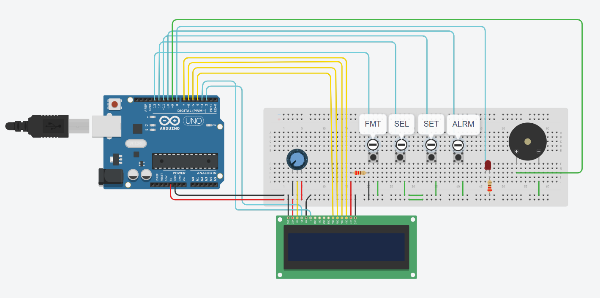

# Simple Clock w/ Alarm
## A simple prototype using Arduino in Tinkercad of a simple Clock for teaching purposes.

## State Machine

The project was modeled using a finite state machine (FSM), being a simple project:

## Tinkercad

The prototype can be accessed in the Tinkercad platform, via the [link](https://www.tinkercad.com/things/cIBdRKz8f1z-clock).

